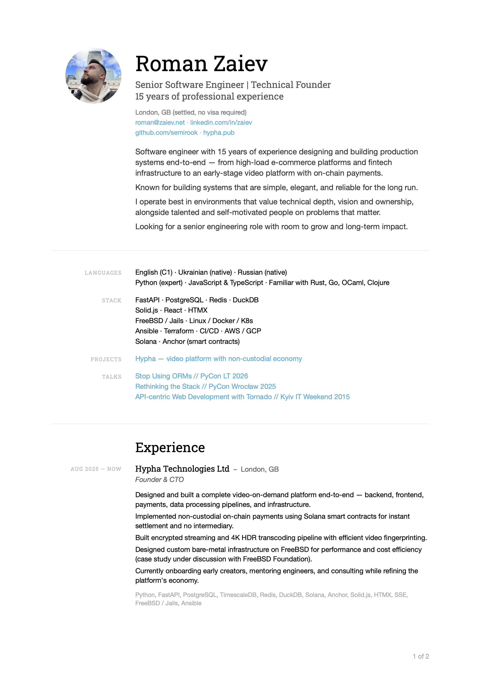

# ITCV

A clean, data-driven CV template built with [Typst](https://typst.app/) — a modern, lightweight alternative to LaTeX. Inspired by Tufte's typographic aesthetics.

The idea is simple: keep your content in a single YAML file and let the template handle the rest.

```yaml
name: Full Name
photo: "me.jpg"
email: me@email.com
who:
  - Great Developer
experience:
  - years: Jan 2025 — Now
    employer: Company
    city: City, Country
    job: Software Engineer
    details:
      - "What you actually did"
    stack:
      - Python, PostgreSQL, Redis
```

Run `make all` to compile. Run `make watch` to watch and recompile changes live.



## Why Typst

LaTeX is great but bloated, complex and slow. Typst compiles in milliseconds, has much cleaner syntax, and requires no extra packages. Same separation of content and presentation, far less friction.

## Setup

1. Install [Typst](https://typst.app/)
2. Install [Roboto Slab](https://fonts.google.com/specimen/Roboto+Slab) for the best rendering
3. Fill in `cv.yml` with your details
4. Run `make`

## License

[CC BY-SA 3.0](http://creativecommons.org/licenses/by-sa/3.0/)
